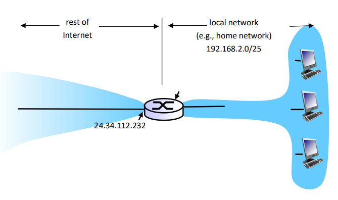
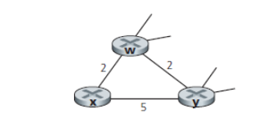

<!--
 * @Github: https://github.com/Certseeds/CS305_Remake
 * @Organization: SUSTech
 * @Author: nanoseeds
 * @Date: 2020-06-27 12:08:26
 * @LastEditors: nanoseeds
 * @LastEditTime: 2020-08-08 22:40:02
 * @License: CC-BY-NC-SA_V4_0 or any later version 
 -->
## 
CS305 Computer Network

## 
HomeWork_3

**SID**:  $********$   
**Name**:  nanoseeds  

### Question 1

Consider a datagram network using 8-bit host addresses. Suppose a router uses longest prefix matching and has the following forwarding table:

| Prefix | Match |
| :----- | :---- |
| 00     | 0     |
| 01     | 1     |
| 10     | 1     |
| 110    | 2     |
| 111    | 3     |

For each of the four interfaces, give the associated range of destination host addresses and the number of addresses in the range

### Question 2

Consider a router that interconnects three subnets: Subnet 1, Subnet 2, and Subnet 3. Suppose all interfaces in these three subnets are required to have the prefix 222.1.16/24. Also suppose that Subnet 1 is required to support at least 60 interfaces, Subnet 2 is to support at least 90 interfaces, and Subnet 3 is to support at least 12 interfaces. Provide three network addresses (of the form a.b.c.d/x) that satisfy these constraints, please show the calculation procedure

### Question 3

Consider the network setup in the figure below. Suppose that the ISP instead assigns the router the address 24.34.112.232 and that the network address of the home network is 192.168.2.0/25.

1. Assign addresses to all interfaces in the home network.

2. Suppose each host has two ongoing TCP connections, all to port 80 at host 128.119.40.87. Provide the six corresponding entries in the NAT translation table.

   
  
Fig.1

### Question 4

What is the difference between a forwarding table that we encountered in destinationbased forwarding in Section 4.1 and OpenFlow's flow table that we encountered in Section 4.4?

### Question 5

Consider the following network. With the indicated link costs, use Dijkstra's shortest-path algorithm to compute the shortest path from x to all network nodes. Show how the algorithm works and show the final forwarding table in x.

   
  
Fig.2

### Question 6
Consider the network fragment shown below. x has only two attached neighbors, w and y. w has a minimum-cost path to destination u (not shown) of 5, and y has a minimum-cost path to u of 6. The complete paths from w and y to u (and between w and y) are not shown. All link costs
in the network have strictly positive integer values.

   
  
Fig.3

