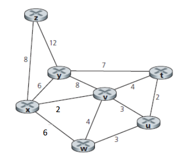
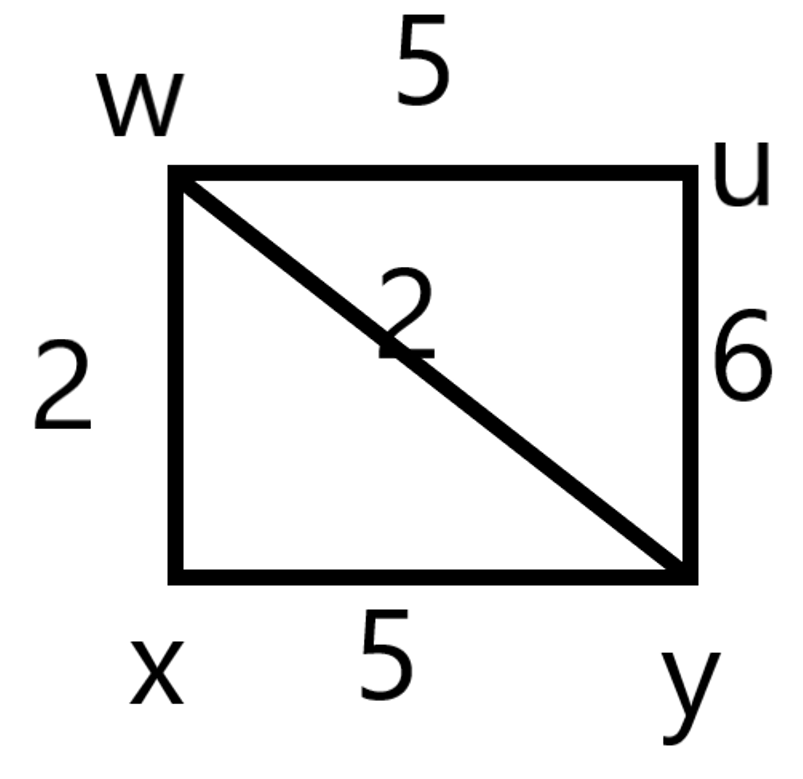

<!--
 * @Github: https://github.com/Certseeds/CS305_2019F_Remake
 * @Organization: SUSTech
 * @Author: nanoseeds
 * @Date: 2020-06-19 16:06:56
 * @LastEditors: nanoseeds
 * @LastEditTime: 2021-01-15 12:10:16
 * @License: CC-BY-NC-SA_V4_0 or any later version 
 -->

# CS305 Computer Network HW3_Report

**SID**:  $********$  

**Name**:  nanoseeds  

## Question 1

Consider a datagram network using 8-bit host addresses. Suppose a router uses longest prefix matching and has the following forwarding table:

| Prefix | Match |
| :----- | :---- |
| 00     | 0     |
| 01     | 1     |
| 10     | 1     |
| 110    | 2     |
| 111    | 3     |

For each of the four interfaces, give the associated range of destination host addresses and the number of addresses in the range

1. Associated range

| interface | Associated range              | Number of Addresses |
| :-------- | :---------------------------- | :------------------ |
| 0         | 00\*\*\*\*\*\*                | 2^6 = 64            |
| 1         | 01\*\*\*\*\*\*,10\*\*\*\*\*\* | 2*2^6 = 128         |
| 2         | 110\*\*\*\*\*                 | 2^5 =32             |
| 3         | 111\*\*\*\*\*                 | 2^5 =32             |

## Question 2

Consider a router that interconnects three subnets: Subnet 1, Subnet 2, and Subnet 3. Suppose all interfaces in these three subnets are required to have the prefix 222.1.16/24. Also suppose that Subnet 1 is required to support at least 60 interfaces, Subnet 2 is to support at least 90 interfaces, and Subnet 3 is to support at least 12 interfaces. Provide three network addresses (of the form a.b.c.d/x) that satisfy these constraints, please show the calculation procedure.

1. Because in the ip-address, all the addresses is division by binary. So Subnet 1 will get at least 64 addresses,2^6; Subset 2 will get 128 addresses,2^7; and subset 3 will also get 16 addresses,2^4.

2. Subnets

|         |                           |
| :------ | :------------------------ |
| Subset2 | 222.1.16.0  (00000000)/25 |
| Subset1 | 222.1.16.128(10000000)/26 |
| Subset3 | 222.1.16.192(11000000)/28 |

## Question 3

Consider the network setup in the figure below. Suppose that the ISP instead assigns the router the address 24.34.112.232 and that the network address of the home network is 192.168.2.0/25.

1. Because their only give the address of the home's network, the address only need to satisfy the given message.

|                    |                     |
| :----------------- | :------------------ |
| Router's inside ip | address 192.168.2.1 |
| PC1 's ip address  | 192.168.2.2         |
| PC2's ip address   | 192.168.2.3         |
| PC3's ip address   | 192.168.2.4         |

2. Although all tcp connections are connect with 128.119.40.186:80,but the clients address are totally can be set as our mind (of course it's better to use different port for each client or router).

|                     |                   |
| :------------------ | :---------------- |
| 24.34.112.232:12345 | 192.168.2.2:23451 |
| 24.34.112.232:12346 | 192.168.2.2:23452 |
| 24.34.112.232:12347 | 192.168.2.3:23453 |
| 24.34.112.232:12348 | 192.168.2.3:23454 |
| 24.34.112.232:12349 | 192.168.2.4:23455 |
| 24.34.112.232:12350 | 192.168.2.4:23456 |

## Question 4

What is the difference between a forwarding table that we encountered in destination-based forwarding in Section 4.1 and OpenFlow's flow table that we encountered in Section 4.4?

1. The forwarding table we encountered in destination-based forwarding in Section 4.1 is just a table that Have two part, 1st is the address range and the 2nd  is interface, it is very easy: it receive a message, and use longest address prefix to matches those address range, and send the message to the best matched address" interface. 

  In this table, the message will only be judged to send to an port after matches all addresses.

2. The OpenFlow's flow table is more flexible, first of all, it is organized mainly by Match Rules, Actions, Priorities and Counters.
The datagrams first match the rules by priorities, then do the Actions and update counters. The match rules are more complex than forwarding table, which contains switch ports, VLAN ID, Mac src, Mac dst, Eth type, Ip src, Ip Dst, Ip port, TCP src-port and TCP dst-port, include almost all message in link layer, Network layer and Transport layer. The order is match order by the priorities. The actions is also more complex, it can drop it, decide to send it to one port or even change something is the datagram. 

  The counter will also remind some message of the datagrams pass through the devices.

3. After all, OpenFlow's flow table matches datagram by priorities, can do more complex match and actions, it also can remind message. What's more, because of it's complex , it can works routers, switches, firewalls and other devices instead of only in routers.

## Question 5

   
  
Fig.1

1. First of all, we need to name the ports that connect with x, we name the port which connect with z “port 1”,connect with y “port 2”, connect with v “port 3”, connect with w “Port 4”.of course, x itself do not need to consider. Than 

| steps |       N       | D(z),p(z) | D(y),p(y) | D(v),p(v) | D(t),p(t) | D(u),p(u) | D(w),p(w) |
| :---: | :-----------: | :-------: | :-------: | :-------: | :-------: | :-------: | :-------: |
|   0   |       x       |    8,x    |    6,x    |    2,x    |  ∞,null   |  ∞,null   |    6,x    |
|   1   |      x,v      |    8,x    |    6,x    |    2,x    |    6,v    |    5,v    |    6,x    |
|   2   |     x,v,u     |    8,x    |    6,x    |    2,x    |    6,v    |    5,v    |    6,x    |
|   3   |    x,v,u,t    |    8,x    |    6,x    |    2,x    |    6,v    |    5,v    |    6,x    |
|   4   |   x,v,u,t,w   |    8,x    |    6,x    |    2,x    |    6,v    |    5,v    |    6,x    |
|   5   |  x,v,u,t,w,y  |    8,x    |    6,x    |    2,x    |    6,v    |    5,v    |    6,x    |
|   6   | x,y,u,t,w,y,z |    8,x    |    6,x    |    2,x    |    6,v    |    5,v    |    6,x    |

In step 0,x is zero, and z,y,v,w is connected.

In step 1,add v in N", change the D and p.  
In step 2,add u in N", change the D and p.  
In step 3,add t in N", change the D and p.  
In step 4,add w in N", change the D and p.  
In step 5,add y in N", change the D and p.  
In step 6,add z in N", change the D and p.  
Every step add the node which have smallest D value.  

1. Reply on the form in 1,the forwarding table is :

|  Aim  |  node Port   |
| :---: | :----------: |
|   U   | Port 3 (x,v) |
|   T   | Port 3 (x,v) |
|   Z   | Port 1 (x,z) |
|   Y   | Port 2 (x,y) |
|   V   | Port 3 (x,v) |
|   W   | Port 4 (x,w) |

## Question 6.

Consider the network fragment shown below. x has only two attached neighbors, w and y. w has a minimum-cost path to destination u (not shown) of 5, and y has a minimum-cost path to u of 6. The complete paths from w and y to u (and between w and y) are not shown. All link costs in the network have strictly positive integer values. 

   
  
Fig.2

The graph can be understand as the graph above

1. The graph of Node x:

|       |      |      |      |      |
| :---: | :--- | :--- | :--- | :--- |
|       | x    | w    | y    | U    |
|   x   | 0    | 2    | 4    | 7    |

2. When the smallest cost of a node have changes, then it will inform its neighbors.
So it c(x,w) is 1,then x will infor its neighbors.
3. If the smallest cost of x do not change, then it will not inform its neighbors.
So if c(x,y) change from 5 to 7,it will not inform its neighbors  

