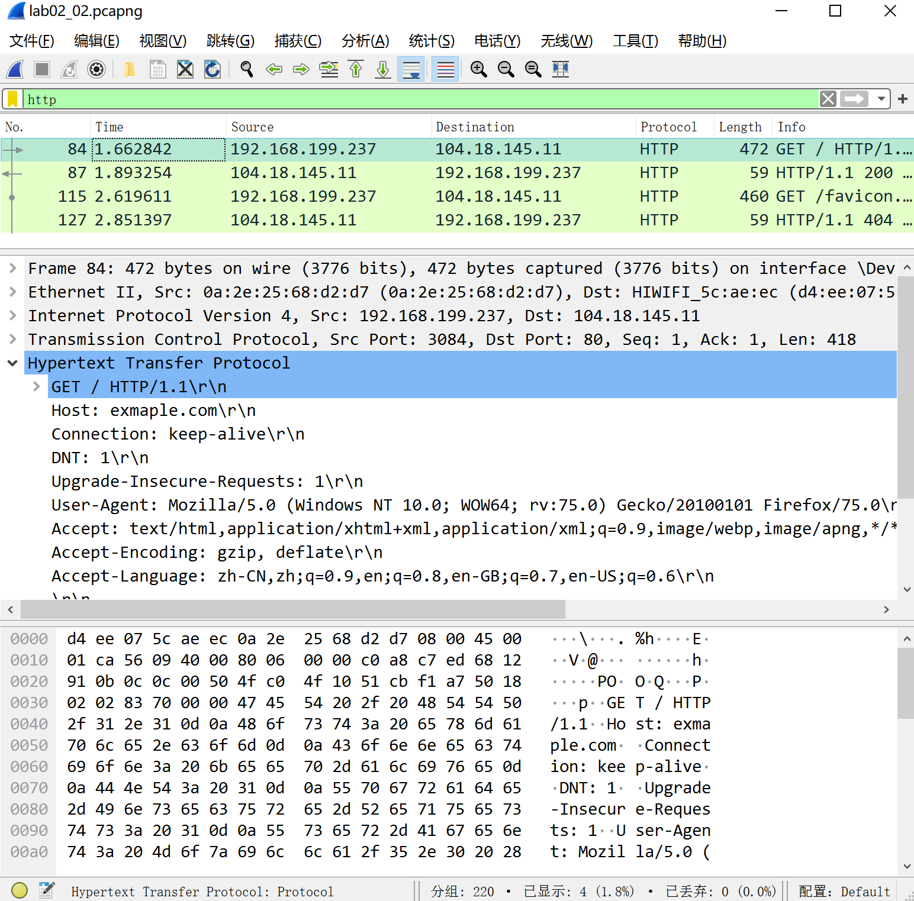
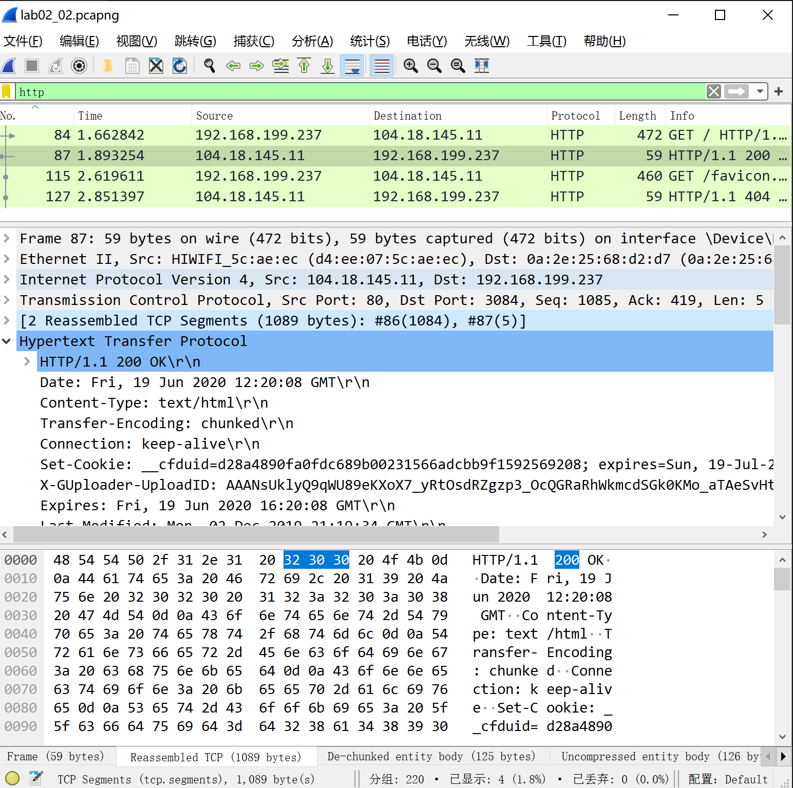
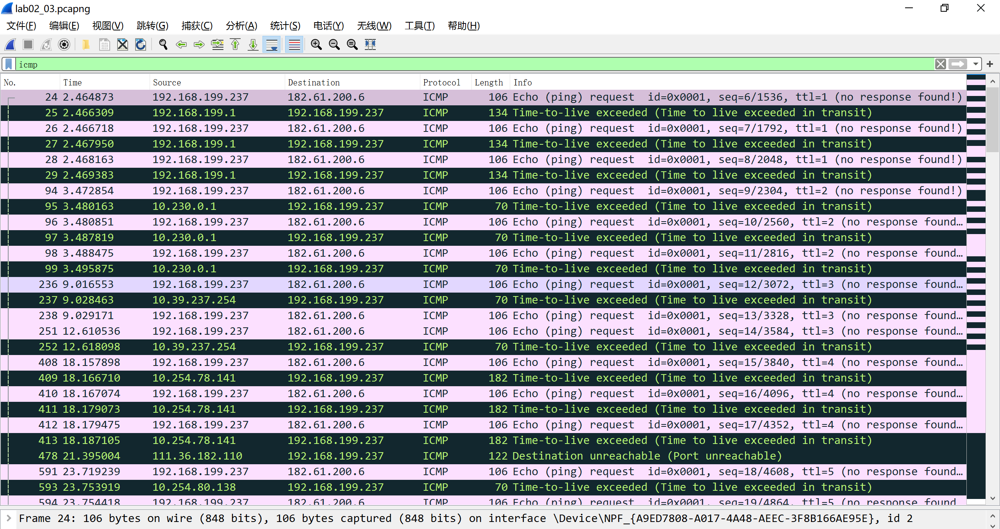

<!--
 * @Github: https://github.com/Certseeds/CS305_2019F_Remake
 * @Organization: SUSTech
 * @Author: nanoseeds
 * @Date: 2020-06-19 16:06:56
 * @LastEditors: nanoseeds
 * @LastEditTime: 2020-08-08 22:45:19
 * @License: CC-BY-NC-SA_V4_0 or any later version 
 -->
## <div>CS305 Computer Network</div>
## <div>Report_Lab02</div>
**SID**:  \*\*\*\*\*\*\*\*   
**Name**:  nanoseeds  

### Question 1

The first function uses a loop to add numbers, the second use a loop to judge is the number prime.

``` python
def find_prime(start: int, end: int) -> List[int]:
    prime_array: List[int] = []
    for i in range(start, end + 1):
        if judge_is_prime(i):
            prime_array.append(i)
    return prime_array

def judge_is_prime(number: int) -> bool:
    if number == 2:
        return True
    max_value: int = (int)((number) ** (1 / 2)) + 1
    for i in range(2, max_value + 1):
        if number % i == 0:
            return False
    return True
```

### Question 2
1.  Use `http` filter to find the HTTP packets

  <div>
  <br />
  <div>Fig.1</div>
</div>

1. In the graph below, there are five level,
  + The source ip address is  `192.168.199.237`
  + The source port is `3084`
  + The destination's ip address is `104.18.145.11`
  + The destination port is `80`
  
1. 
  <div>
  <br />
  <div>Fig.2</div>
  </div>
  
  +  The Host is example.com, the same with the domain
  + The User-agent is the same with my UA (But I use a random User-Agent extension so it always changes)
  + The Accept-Language is the still same to my browser.

### Question 3
1. + 使用`tracert www.baidu.com`,得到的记录如下.

``` log
通过最多 30 个跃点跟踪
到 www.a.shifen.com [182.61.200.6] 的路由:

  1     1 ms     1 ms     1 ms  Hiwifi.lan [192.168.199.1] 
  2     7 ms     7 ms     7 ms  10.230.0.1 
  3    12 ms     *        7 ms  10.39.237.254 
  4     8 ms    12 ms     7 ms  10.254.78.141 
  5    34 ms   123 ms    78 ms  10.254.80.138 
  6     *        *        *     请求超时。
  7    42 ms    41 ms    39 ms  211.148.197.218 
  8    46 ms    51 ms    63 ms  182.61.252.104 
  9    44 ms    43 ms    44 ms  182.61.252.214 
 10     *        *        *     请求超时。
 11     *        *        *     请求超时。
 12     *        *        *     请求超时。
 13    71 ms    75 ms    80 ms  182.61.200.6 

跟踪完成。
```
  + 使用wireshark截图如下
  <div>
  <br />
  <div>Fig.3</div>
  </div>

2. 
  + in the log of tracert, it seems that foe every hop, it sends 3 packets.
  + In the second graph, we can find that for each ttl = x (x is a variable), there exist 3 packets (those pink packets, ttl = x can be find in the rightest direction). 

3. Those Black & Green packets are received packets (However there are three pink packets which is received in the below of graph). There exist three kind of packets in this graph.
  1.  First include “Time to live exceeded”, which means packet’s TTL is zero and then was the finally router send a packet to inform the origin one.
  It’s source IP address include
    + `192.168.199.1` (my router’s default address)
    + `10.230.0.1` (the school network’s default address)
    + `10.39.237.254`
    + `10.254.78.141`
    + `10.254.80.138`
    + etc

  2. The second is just "Destination unreachable", which means one router find it cannot be send to anyone.
    + their ip address include `110.36.182.110`, `119.121.99.216`

  3.  the third packets's inform is "Echo(ping)Reply" The ip address is `182.61.200.6`(the final ip address of www.baidu.com)

4. There are 13 jumps in tracert, but jump 6,10,11,12 do not have number. so just need count others.

  1. jump 1

| order |  begin   |   end    | time |
| :---- | :------: | :------: | ---: |
| 1     | 2.464873 | 2.466309 |      |
| 2     | 2.466718 | 2.467950 |      |
| 3     | 2.468163 | 2.469383 |      |

 2. jump 1

| order |  begin   |   end    | time |
| :---- | :------: | :------: | ---: |
| 1     | 3.472854 | 3.480163 |      |
| 2     | 3.480851 | 3.487819 |      |
| 3     | 3.488475 | 3.495875 |      |

 3. jump 3

| order |   begin   |    end    | time |
| :---- | :-------: | :-------: | ---: |
| 1     | 9.016553  | 9.028463  |      |
| 2     | 9.029171  | 12.618068 |      |
| 3     | 12.610536 | 18.166710 |      |

other jumps do not show in there.

In conclusion, it seems that the algorithm of tracert count time is just get the integer
part of double packets’ times’ distance unless it’s to short to another integer.

<style type="text/css">
div{
  text-align: center;
}
div>div {
  text-align: center;
  border-bottom: 1px solid #d9d9d9;
  display: inline-block;
  padding: 2px;
}
div>img{
  border-radius: 0.3125em;
  box-shadow: 0 2px 4px 0 rgba(34,36,38,.12),0 2px 10px 0 rgba(34,36,38,.08);
}
</style>