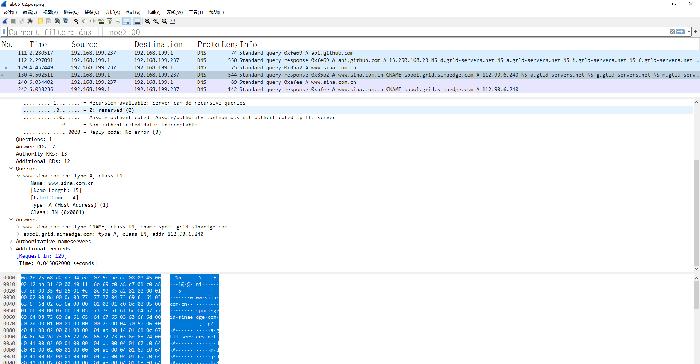

<!--
 * @Github: https://github.com/Certseeds/CS305_2019F_Remake
 * @Organization: SUSTech
 * @Author: nanoseeds
 * @Date: 2020-06-19 16:06:56
 * @LastEditors: nanoseeds
 * @LastEditTime: 2020-08-08 23:30:36
 * @License: CC-BY-NC-SA_V4_0 or any later version 
 -->
## <div>CS305 Computer Network</div>
## <div>Report_Lab05</div>
**SID**:  \*\*\*\*\*\*\*\*   
**Name**:  nanoseeds  


### Question 1
1. use command `dig www.baidu.com +edns=0 +dnssec` 

``` log
; <<>> DiG 9.11.3-1ubuntu1.11-Ubuntu <<>> www.baidu.com +edns=0 +dnssec
;; global options: +cmd
;; Got answer:
;; ->>HEADER<<- opcode: QUERY, status: NOERROR, id: 59716
;; flags: qr rd ra; QUERY: 1, ANSWER: 3, AUTHORITY: 5, ADDITIONAL: 6

;; OPT PSEUDOSECTION:
; EDNS: version: 0, flags: do; udp: 4096
;; QUESTION SECTION:
;www.baidu.com.			IN	A

;; ANSWER SECTION:
www.baidu.com.		940	IN	CNAME	www.a.shifen.com.
www.a.shifen.com.	65	IN	A	182.61.200.7
www.a.shifen.com.	65	IN	A	182.61.200.6

;; AUTHORITY SECTION:
a.shifen.com.		675	IN	NS	ns4.a.shifen.com.
a.shifen.com.		675	IN	NS	ns3.a.shifen.com.
a.shifen.com.		675	IN	NS	ns2.a.shifen.com.
a.shifen.com.		675	IN	NS	ns1.a.shifen.com.
a.shifen.com.		675	IN	NS	ns5.a.shifen.com.

;; ADDITIONAL SECTION:
ns1.a.shifen.com.	195	IN	A	61.135.165.224
ns2.a.shifen.com.	66	IN	A	220.181.33.32
ns3.a.shifen.com.	374	IN	A	112.80.255.253
ns4.a.shifen.com.	364	IN	A	14.215.177.229
ns5.a.shifen.com.	364	IN	A	180.76.76.95

;; Query time: 40 msec
;; SERVER: 192.168.199.1#53(192.168.199.1)
;; WHEN: Mon Jun 22 22:49:09 +08 2020
;; MSG SIZE  rcvd: 271
```
以上是运行得到的结果,

2. 

<div>
  <br />
  <div>Fig.1</div>
</div>

  + Part A:
    + Name: www.baidu.com
    + Type: A (get Host address)
    + Class: IN
  + Part B:
  Because in the Additional records there have EDNS0: version 0 What’s more, there have 16bits of Z, which is all 0.
  + Part C:
  From this query message, it can Accept DNSSEC security RRs.

3. 

<div>
  <br />
  <div>Fig.2</div>
</div>
  
  + Part A:
    + There exist three answers,
    + The type of first is CNAME, it’s ttl is 0.
    + The other double’s type is A, there ttl is 4.
  + Part B:
    + There exist five authority RRS, all of their type are NS.
  + Part C:
    + There exist one special additional RRs with OPT type.
    + It’s “Do bit” is 1: it can accept DNSSEC security RRs.


### Question 2
1. The graph  use UDP and TCP to query www.sina.com.cn by set tcp is false, Set use tcp.

<div>
  <br />
  <div>Fig.3</div>
</div>

2. by look at the source code of dns.resolver, the default protocol is udp:

<div>
  <br />
  <div>Fig.4</div>
</div>

<div>
  <br />
  <div>Fig.5,screenshot of the packets(ignore github)</div>
</div>

In the next four screenshots, double is use udp,the other double use tcp.
<div>
  <br />
  <div>Fig.6, tcp send</div>
</div>
<div>
  <br />
  <div>Fig.7, tcp recieve</div>
</div>
<div>
  <br />
  <div>Fig.8, udp send</div>
</div>
<div>
  <br />
  <div>Fig.9, udp recieve</div>
</div>

In this process, it catches 2 tcp packet and 2 udp packet.
  + The request of tcp use 64901 port and send it to 53 port.
  + The response of tcp’s send port is 53 and receive port is 64901.
  + The request of udp use 3117 port and send it to 53 port.
  + The response of udp’s send port is 53 and receive port is 3117.
  + For the query message, first there protocol is different, so there deeper level’s message is not the same, but the answer in the Domain Name System part is the same.
  + However, tcp do not contain authoritative nameservers and Additional records.
  + At least the response Answers in print is the same.
  + But however, in Wireshark, it’s obviously in udp, response contain Queries, Answers, Authoritative nameservers, Additional records. But in tcp’s response, only exist queries and Answers. (of course, there ttl is different, neither).
Answer: 
+ Number of TCP packets should be 5~9.
+ (three-way handshaking+ 1 request+ 1 response+ four-way handshake) 
+ Number of UDP packets should be 2.
+ (1 request+ 1 response) 

### Question 3
0. 我们要实现的实际上是一个dns代理,client端通过`dig @localhost www.baidu.com` 这样的命令和其交互,获取查询结果. 
不管怎样,先来手撕dns request 报文看看.

``` python 
bin:bytes = b'\xcf\x9b\x01\x20\x00\x01\x00\x00\x00\x00\x00\x01\x03www\x05baidu\x03com\x00\x00\x01\x00\x01\x00\x00)\x10\x00\x00\x00\x00\x00\x00\x0c\x00\n\x00\x08\t\xd0l?\x1dY\x0b\x93'
data: List[int] = list(bin)
id: List[int]=data[0:2]  # [207,155]
header: List[int]=data[0:12]  #[207,155,1,32,0,1,0,0,0,0,0,1]
data[10:12] = [0,0]  # header不变
domain_finish: List[int] = self.get_ques_domain_end(data)  # 27,这里的目的是找到网址之后的第一个字符,把网址解出来
## 既要使用长度信息,又要确保domain_name以8为单位.
ques_name: List[int] = data[12:domain_finish] 
# [3,119,119,119,5,98,97,105,100,107,3,99,111,109,0]
ques_type: List[int] = data[domain_finish:domain_finish + 2] # [0,1]
ques_class: List[int] = data[domain_finish + 2:domain_finish + 4] # [0,1]
## 因为是查询,所以之后的都没有意义,可以扔掉了
self.Answers: List[int] = data[domain_finish + 4:]
```

实际上并不需要解析得太详细,只需要解出question就好,这样就可以利用question相同进行缓存.
真正需要手撕的就是request的question部分,以及答复的ttl部分.
需要利用其进行缓存以及缓存的清除.

<style type="text/css">
div{
  text-align: center;
}
div>div {
  text-align: center;
  border-bottom: 1px solid #d9d9d9;
  display: inline-block;
  padding: 2px;
}
div>img{
  border-radius: 0.3125em;
  box-shadow: 0 2px 4px 0 rgba(34,36,38,.12),0 2px 10px 0 rgba(34,36,38,.08);
}
</style>