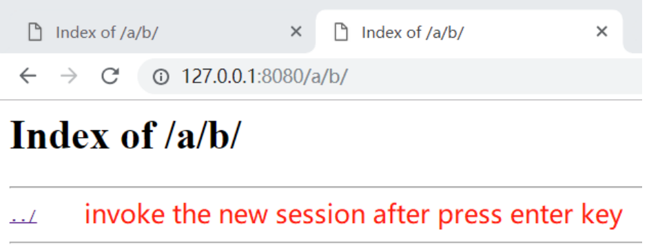

<!--
 * @Github: https://github.com/Certseeds/CS305_Remake
 * @Organization: SUSTech
 * @Author: nanoseeds
 * @Date: 2020-06-25 18:21:49
 * @LastEditors: nanoseeds
 * @LastEditTime: 2020-08-08 22:43:44
 * @License: CC-BY-NC-SA_V4_0 or any later version 
 -->
## Report 06 Details

### Question 1: Using dash.js to load a dash resource  

1. Open "Network" view in "developer tools" of browse(such as chrome) to observe

+ Is there any "mpd" files, What's its name, what is the description of "mpd" in mime 

+ Is there any "m4s" files, what's its related rate, will the files" "rate" change along with the changing of network condition(especially the bandwidth)

2. Reference:

+ A html embedded a dash.js which maybe helpful for loading a "mpd" file
  + http://reference.dashif.org/dash.js/nightly/samples/dash-if-reference-player/index.html  
    or
  + https://allen8101070.github.io/ITMAN_DASHjs/index.html
+ A dataset of dash resources
  + http://www-itec.uni-klu.ac.at/ftp/datasets/DASHDataset2014/

### Question 2

0. Using multi thread (asyncio IO is also ok) and TCP socket to rewrite the http server which is asked in lab assignment 3.3,Based on Assignment 3.3, implement following features:

+ Range Header support
  + With this feature implemented, user can pause and resume download file from the server.
  + Session Cookie support:
    + Remember last folder user visited, response with 302 Found if user access root directory.
    
    Example:  
    Request: GET http://localhost:8080  
    Response: 302 Found, Location: http://localhost:8080/lastdir  

Ps:"lastdir" here refers to the last path in the previous session  
Reference: https://developer.mozilla.org/en-US/docs/Web/HTTP/Headers/Location  

1. A simple test scenario on session cookie support is described as follow:

+ Step 1: add the python file which will be run as a advance web file system server into a testing directory which got a sub_directory named "a" with a sub_directory "b".
+ Step 2: invoke the "web_file_system_server"
+ Step 3: open a browser such as chrome, invoke the 1st session by using 127.0.0.1:8080 as URL, the press Enter key. 

   
  
Fig.1

  + Step 4: the this session, click hyperlink "a" to access "/a", then click hyperlink "b" in the new page to access "/a/b". if invoke a new session to 127.0.0.1:8080, "/a/b" is the "lastdir".

   
  
Fig.2

  + Step 5: prepare for a new session: open a new tab of the browser and using 127.0.0.1:8080 as URL, before press Enter key, you will see:

   
  
Fig.3

  
  + Step 6: invoke the new session: after finish step5, press Enter key to invoke the new session, if your code works, you will see(the URI "/" on127.0.0.1:8080 is redirected to the "lastdir": /a/b)

   
  
Fig.4

