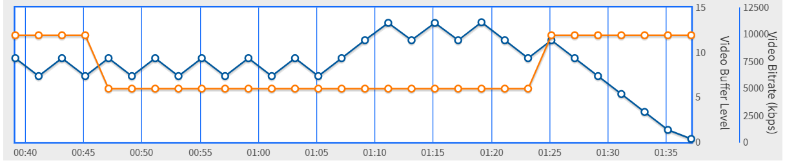
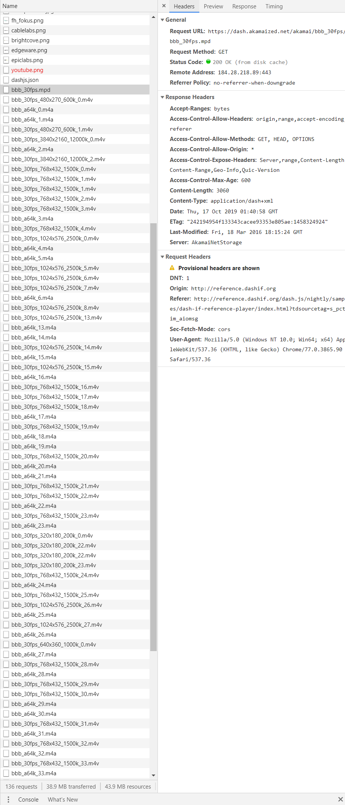

<!--
 * @Github: https://github.com/Certseeds/CS305_Remake
 * @Organization: SUSTech
 * @Author: nanoseeds
 * @Date: 2020-06-25 20:04:26
 * @LastEditors: nanoseeds
 * @LastEditTime: 2020-08-08 22:43:32
 * @License: CC-BY-NC-SA_V4_0 or any later version 
 -->
## 
CS305 Computer Network
  
## 
Report_Lab06

**SID**:  $********$   
**Name**:  nanoseeds  

### Question 1

0. In this question, use the "http://reference.dashif.org/dash.js/nightly/samples/dash-if-reference-player/index.html?tdsourcetag=s_pctim_aiomsg" to help get the related rate and resolution ratio. And the mpd file come from https://dash.akamaized.net/akamai/bbb_30fps/bbb_30fps.mpd  
(The reason why I don't choose another mpd file in http://www-itec.uni-klu.ac.at/ftp/datasets/DASHDataset2014 is most of them are so slow that it cannot be Played ,although I use a VPN to speed up it)

1. There is a mpd file, the name of it is "bbs_30fps.mpd", the Context-Type of it is "application/dash+xml".

there exist a lot of m4s files, the highest related rate is 12000k, and lowest to 200k/sec(and the fps is always 30), and the related rate and resolution ratio will change with the network condition (because this web must use a V*N to surface, so its related rate change severe) 

   
  
Fig.1

That is a screenshot of the related rate and resolution ratio, they are changing every time.
PS: there have another screenshot in next page

   
  
Fig.2

