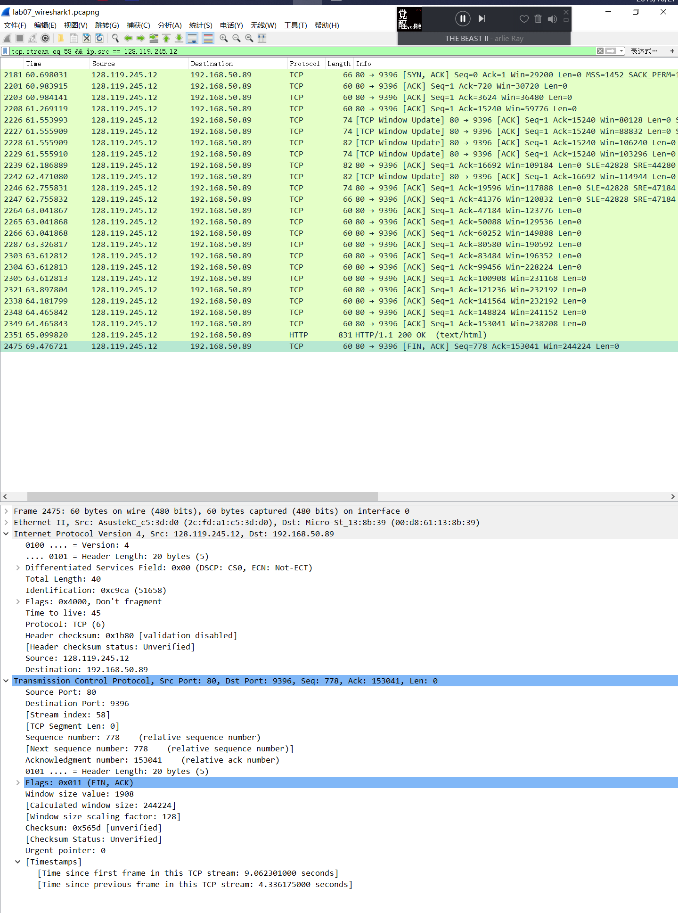

<!--
 * @Github: https://github.com/Certseeds/CS305_2019F_Remake
 * @Organization: SUSTech
 * @Author: nanoseeds
 * @Date: 2020-06-19 16:06:56
 * @LastEditors: nanoseeds
 * @LastEditTime: 2020-08-08 23:28:39
 * @License: CC-BY-NC-SA_V4_0 or any later version 
 -->
## 
CS305 Computer Network

## 
Report_Lab07

**SID**:  \*\*\*\*\*\*\*\*   
**Name**:  nanoseeds  

### Question 1

   
  
Fig.1

0. First of all, the screenshot is in upper
1. UDP’s head have four fields
2. they are "Source Port", "Destination Port", "Length", "Checksum".
3. All of them are two Bytes,16 bits.
4. Because UDP’s "length" fields is 2 bytes,16bit, so the all UDP part’s length’s maximum value is $65535_{10}$ or (11111111 1111111¬2) or 0xff bytes, but the UDP’s head have 8 bytes, IP have 20 bytes, so UDP its own data’s length’s maximum length is 65535-8-20 = 65507 bytes.
Correct: 2^16-1-8 = 65536-9 = 65527(UDP 包头)
5. "Source Port" & "Destination Port" both have 2 bytes,16bits length. So their maximum value is $65535_{10}$ or (11111111 1111111¬2) or 0xff.
6. The protocol number for UDP is 0x11, or 1710.

### Question 2

##### 4
The sequence number of TCP SYN segment that used to initiate the TCP connection between the client computer and gaia.cs.umass.edu is 0x80076d2b(but in wireshark’s analysis, it is 0).

   
  
Fig.2

And the flags is 0x02,which means the SYN bit is 1, so this segment is identifies as a SYN segment.

##### 6
The sequence number of the TCP segment containing the HTTP POST command is 0xb70bd020(but in Wireshark’s analysis, it is 1)..

   
  
Fig.3

##### 7
First of all, in the No.2346:

   
  
Fig.4

Then should find them one by one,
  + Segment1：

  

     
    
Fig.5

  

  + Segment2：

  

     
    
Fig.6

  

  + Segment3：

  

     
    
Fig.7

  

  + Segment4：

  

     
    
Fig.8

  

  + Segment5：

  

     
    
Fig.9

  

  + Segment6：

  

     
    
Fig.10

  

Their sequence numbers is 

|   Ans:   | Sequence number | Sent time | Ack Received time |       RTT       | EstimatedRTT Value | Length/Bytes |
| :------: | :-------------: | :-------: | :---------------: | :-------------: | :----------------: | :----------: |
| Segment1 |  1 0xb70bd020   | 60.698356 |     60.983915     |    0.285559     |      0.285559      |     719      |
| Segment2 | 720  0xb70bd2ef | 60.698431 |   don’t receive   | Can’t calculate |   Can’t calculat   |     1452     |
| Segment3 | 2172 0xb70bd89b | 60.698433 |     60.984141     |    0.285708     |    0.285577625     |     1452     |
| Segment4 | 3624 0xb70bde47 | 60.698433 |   don’t receive   | Can’t calculate |  Can’t calculate   |     1452     |
| Segment5 | 5076 0xb70be3f3 | 60.698434 |   don’t receive   | Can’t calculate |  Can’t calculate   |     1452     |
| Segment6 | 6528 0xb70be99f | 60.698434 |   don’t receive   | Can’t calculate |  Can’t calculate   |     1452     |

Their send time is 64.181837,64.465842,64.465843,64.099820,65.099820,65.140546. EstimatedRTT = 0.875 * Last EstimatedRTT + 0.125 * sample RTT 
However, I don’t receive a few ack packets.   
After Segment 1: EstimatedRTT = 0.285559   
After Segment 3: EstimatedRTT = 0.875 * 0.285559+ 0.125*0.285708 = 0.285577625  
Others don’t get  

##### 9 
Answer:
The minimum amount of available buffer space advertised at gaia.cs.umass.edu for the entire trace is 29200 bytes in the begging.
The minimum amount of available buffer space advertised at gaia.cs.umass.edu for the entire trace increase slowly, finally, the amount is 244224 bytes in the end.
In the same time, the ack is smaller than win, it means the sender is never thorttled because of lack receiver buffer space by inspecting this trace.

   
  
Fig.11

  

   
  
Fig.12

  

##### 10
There are many retransmitted segments in the trace file, the screenshot in next page show that the sequence number sometimes increase, sometimes decrease, but more than 50% are increasing. So, there exist a few retransmitted segments in the trace file.

##### 12
Total amount of data is 153040 bytes data.(104 * 1452 + 719 + 1313)
However, there exist four retransmission which is 1452 bytes long.  
So, the total amount of data is 108 * 1452 + 719 + 1313 = 158848 bytes.  
Total transmission time is 64.181837 – 60.698356 = 3.483481s  
So, the throughput for the TCP connection is computed as 158848/3.483481 = 45,600.36354439711311759702435581‬ bytes/second = 44.53160502382530577890334409747‬ kByte/sec.

### Question 3
refer to `lab07/src`

