<!--
 * @Github: https://github.com/Certseeds/CS305_Remake
 * @Organization: SUSTech
 * @Author: nanoseeds
 * @Date: 2020-08-01 15:53:50
 * @LastEditors: nanoseeds
 * @LastEditTime: 2020-08-08 23:02:53
 * @License: CC-BY-NC-SA_V4_0 or any later version 
 -->

## 
CS305 Computer Network

## 
Report_Lab10

**SID**:  $********$  
**Name**:  nanoseeds  

### Question 1
1. 

  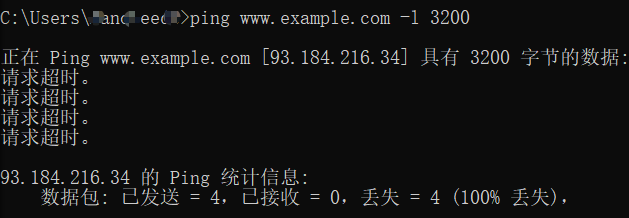 
  
Fig.1

As the screenshot shows,
use “ping www.example.com -l 3200” can initiates an ICMP echo request.

2. Of course there have fragmentation, use “ip.proto == 1” can get them easily.

  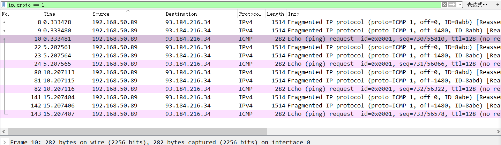 
  
Fig.2

Each request have three fragments.

3. 3200 bytes ip packet have three fragmentation

  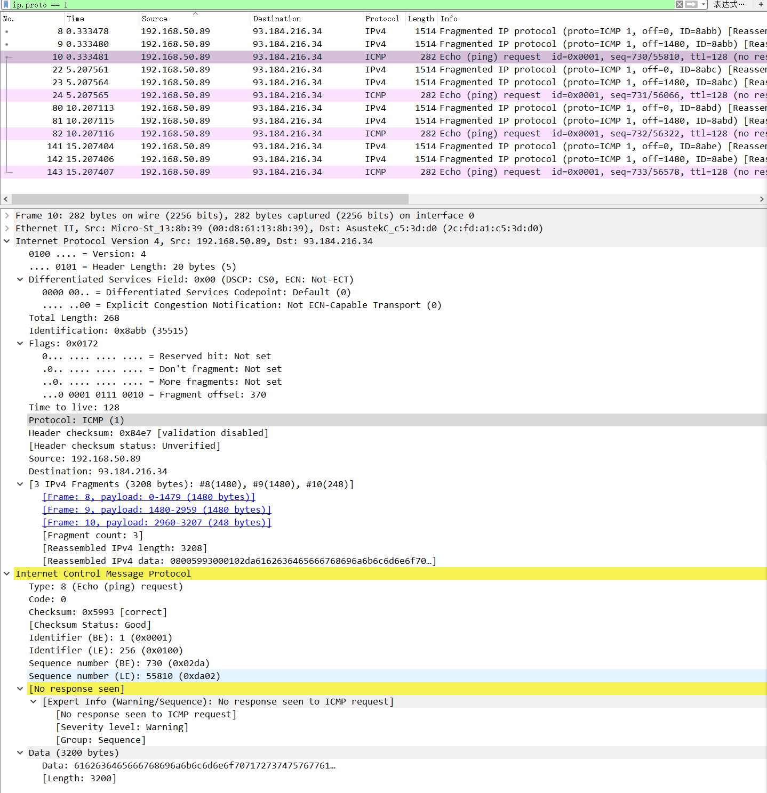 
  
Fig.3

As the screenshot shows, the packet no.10 show it have 3 ipv4 fragments And their Id is the same.

4. It hard to answer that because there don't show any response. Because there don't show any reply, so use another's screenshot!

  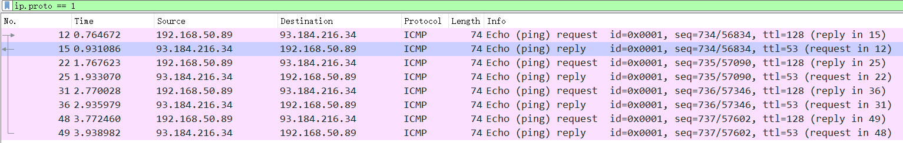 
  
Fig.4

Of Course, there source and destination address are adverse.
In the same time, request's TTL is larger than replies.

5. In the request, there have the flags to show their order:

  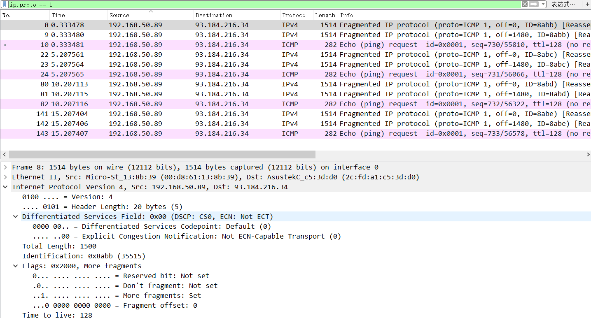 
  
Fig.5

  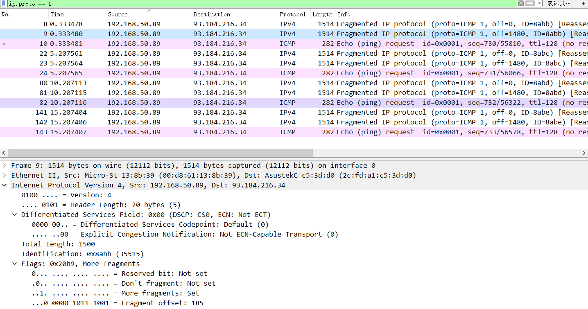 
  
Fig.6

  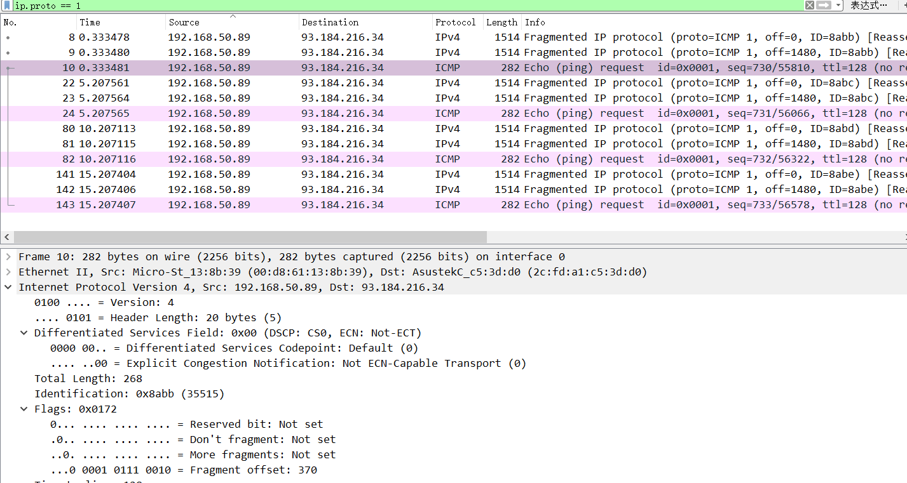 
  
Fig.7

All of the screenshots have Flags, first double packet(No.8,No.9)'s More fragments bit is 1 which shows there have more fragments, and there fragment offset shows there order, the 1st 's offset is 0 of course. The last fragment's More fragment bit is 0 and offset is the max.

6. The No.8 and No.9's IP fragments is 1500 bytes. Include 20 bytes Ip header, 1480 bytes data. The No.10' ip fragments is 268 bytes, include 20 bytes ip header, 8 bytes ICMP header, 240 bytes data.

  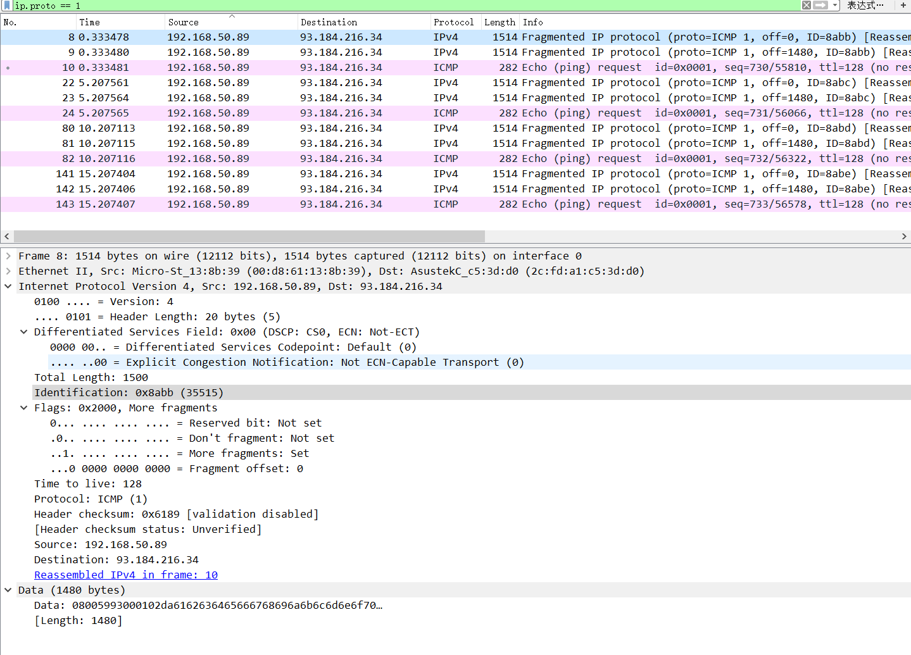 
  
Fig.8

  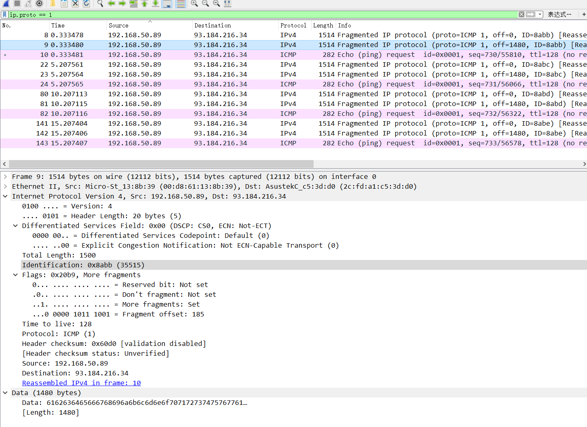 
  
Fig.9

  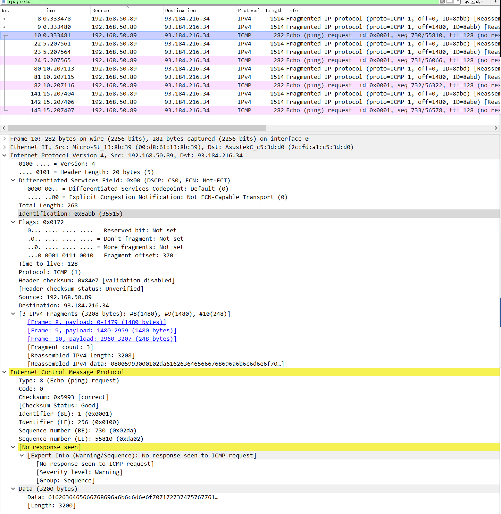 
  
Fig.10

As the screenshot shows, 1480 + 1480 + 240= 3200 == 3200
So although it seems that there's sum is large than 3200, but the data in every fragment is still equal to 3200.

### Question 2

  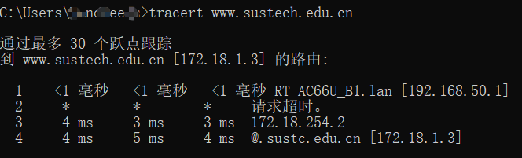 
  
Fig.11

1. Of course there exist Time-to-Live exceeded packets

  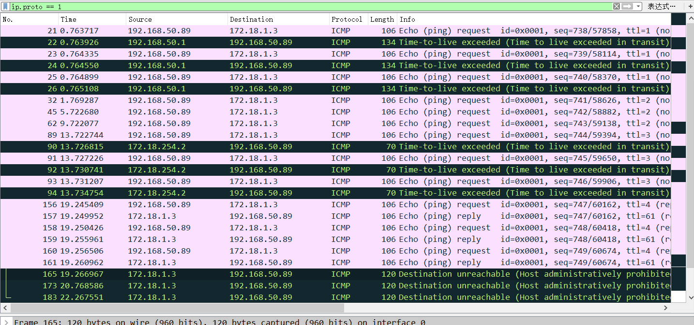 
  
Fig.12

  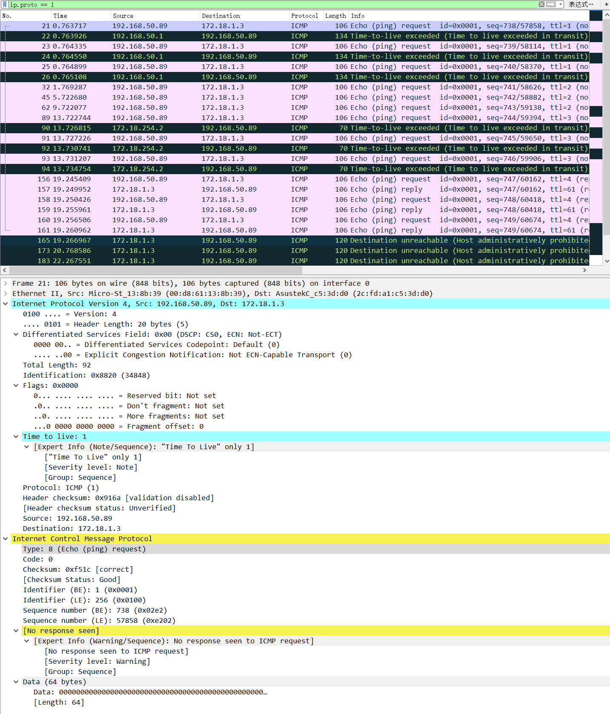 
  
Fig.13

  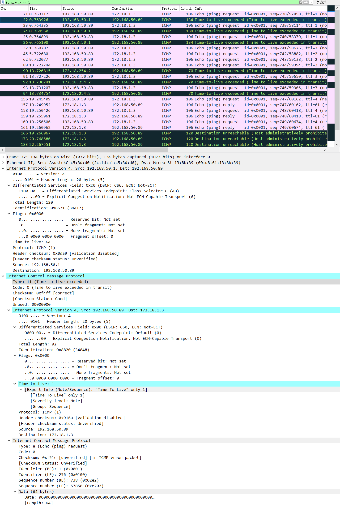 
  
Fig.14

2. 
+ Those packets ICMP-type is 11, which is different with ICMP request's type-8.
+ Those packet's data part includes a request packet which can be analysis as IP and ICMP packet (with their ip header), other ICMP packet will not take another packet in their data part or cannot be analysis as ip and icmp packet.
+ There source and destination address are different with the adverse of the packet in their data part.
+ There length is bigger than the request packet because their data part has another packet.
+ Those packets are sent by middle routes, not the send host or target host.

### Question 3

1. First should use “ipconfig /release” to stop the network connect.
Then use “ipconfig /renew” to update the network message
Should use “dhcp” to find the session packets.

  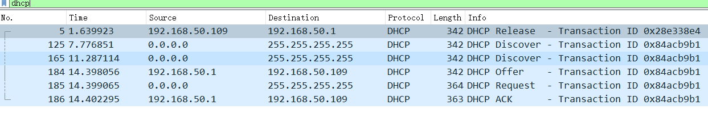 
  
Fig.15

2. In the dhcp request packet, the source address and destination address is 0.0.0.0 and 255.255.255.255. Both of them are reserve address.
0.0.0.0 is a set that means unknown address, usually means the sender don't known it's address.
255.255.255.255 usually means it will be send to other host that under the same router.

  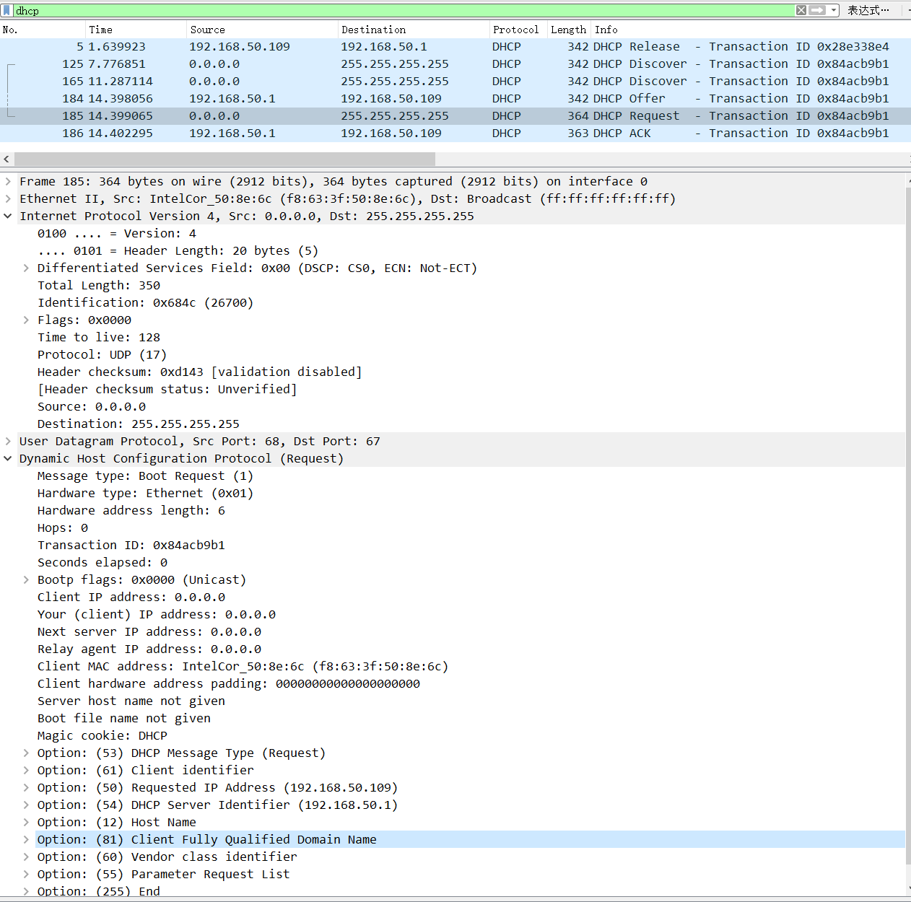 
  
Fig.16

Correct Answer:  
+ Source IP address: 0.0.0.0, which is a non-routable meta-address
+ Destination IP address: 255.255.255.255, which is the limited broadcast address.

1. If host want to contact with others in the internet, it should know itself and the other sides ip address.

Correct Answer: IP address, Subnet Mask, Default Gateway, DNS Server and Host Name -0.2

4. The lease time of a dynamic ip address can be find by “dhcp.option.ip_address_lease_time”. It decides how long the temp address can continue. Usually it was take in the Offer and ACK packets, which in the DHCP level and their Option code is 51.

  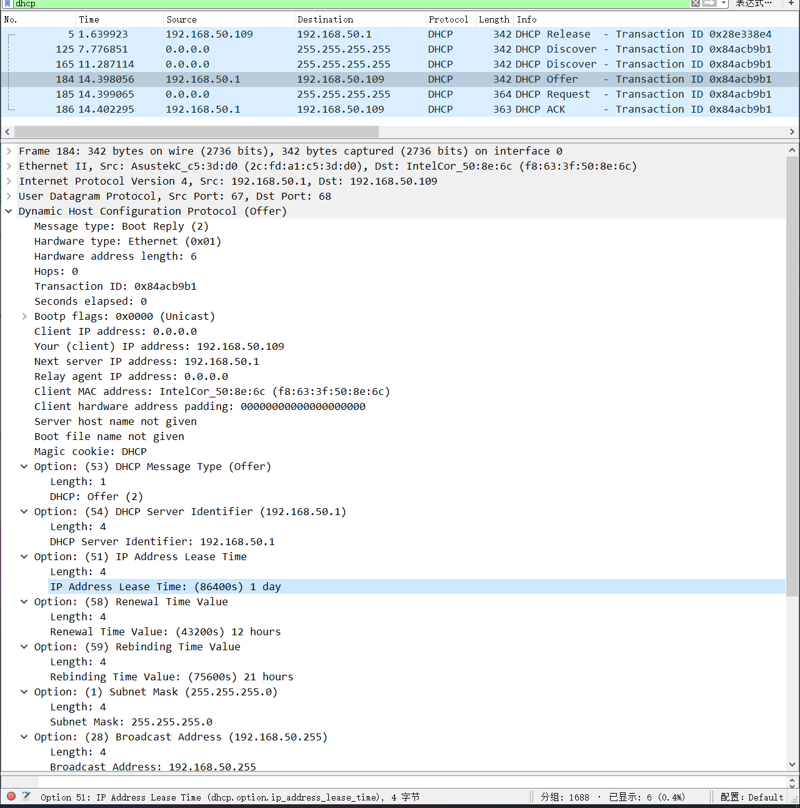 
  
Fig.17

  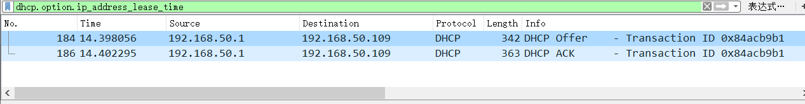 
  
Fig.18

PS: the reason of the Offer packet's destination address is 192.168.50.109 maybe my router use mac-address-bind to bind my laptop'd mac-address and the address. That is the reason of why the address don't change through the release and renew. 

