<!--
 * @Github: https://github.com/Certseeds/CS305_Remake
 * @Organization: SUSTech
 * @Author: nanoseeds
 * @Date: 2020-08-08 22:07:23
 * @LastEditors: nanoseeds
 * @LastEditTime: 2020-08-08 22:46:53
 * @License: CC-BY-NC-SA_V4_0 or any later version 
 -->
## Report 11 Details

注:下述练习使用了Cisco Packet Tracer 软件

### Practice1

  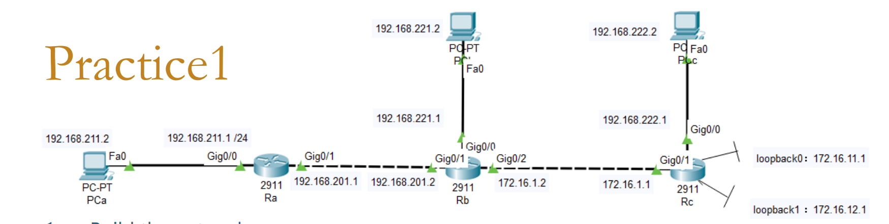 
  
1st

1. Build the network
2. Use "no router rip" to remove the routing items create from rip
3. Enable and Configure rip version 1 on Ra, Rb and Rc
4. Enable and Configure rip version 2 on Ra, Rb and Rc
5. Find the difference between rip1 and rip2 

  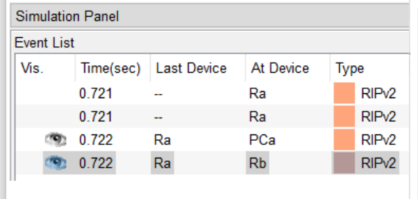 
  
2nd

  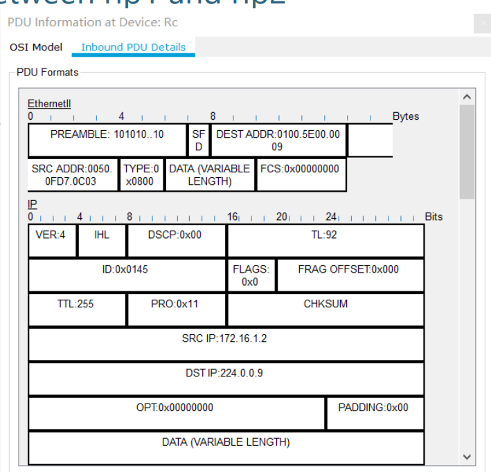 
  
3rd

  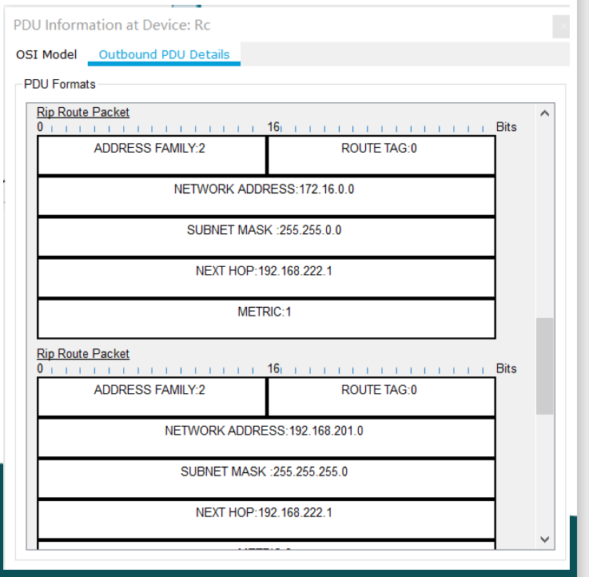 
  
4th

+ Tips :rip1

  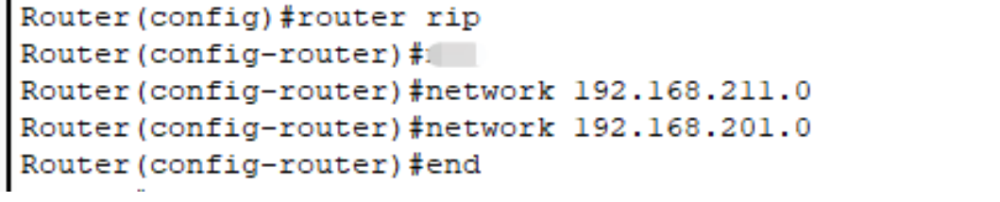 
  
5th

  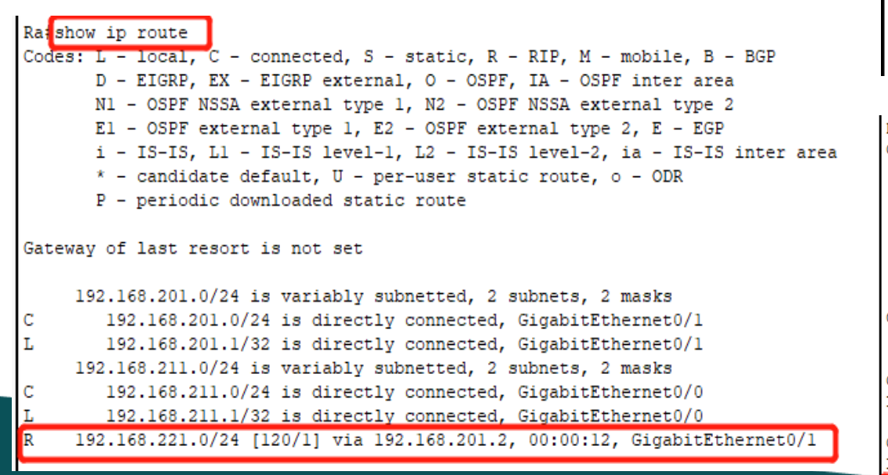 
  
6th

  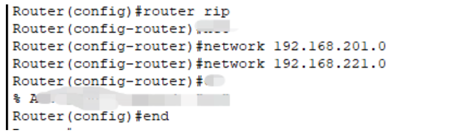 
  
7th

  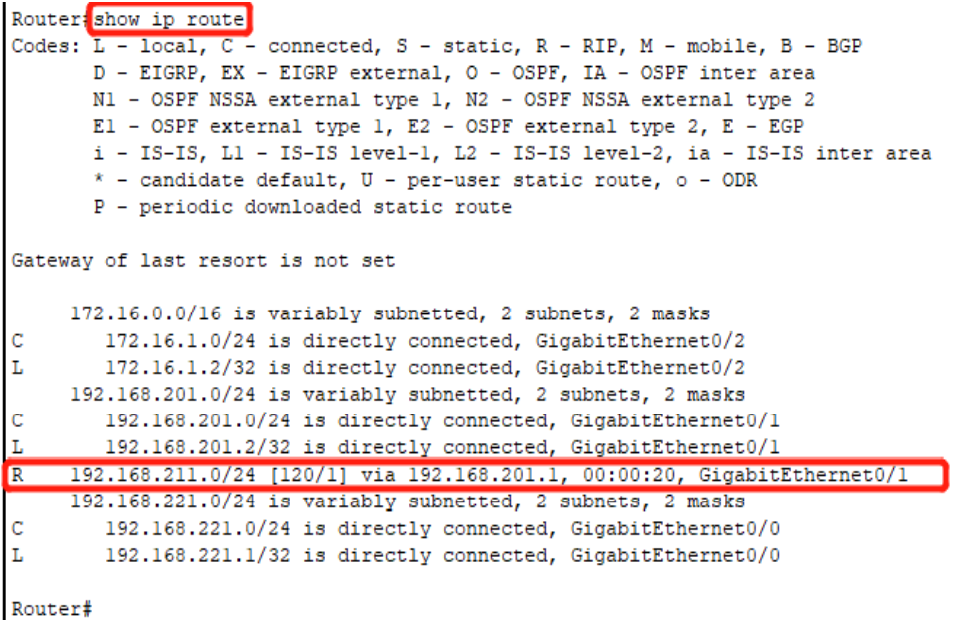 
  
8th

+ Tips: Rip2

  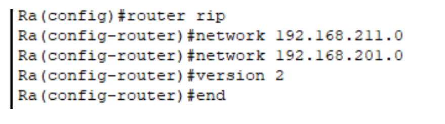 
  
9th

  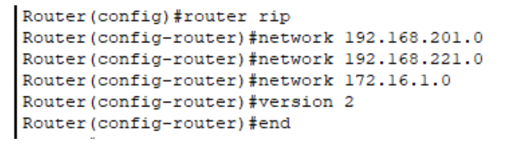 
  
10th

  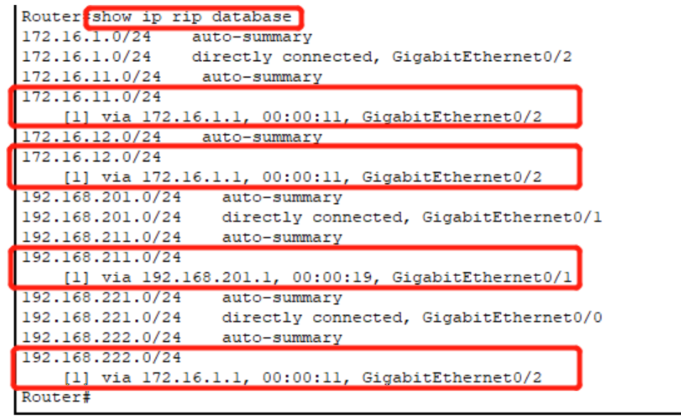 
  
11th

### Practice 2

  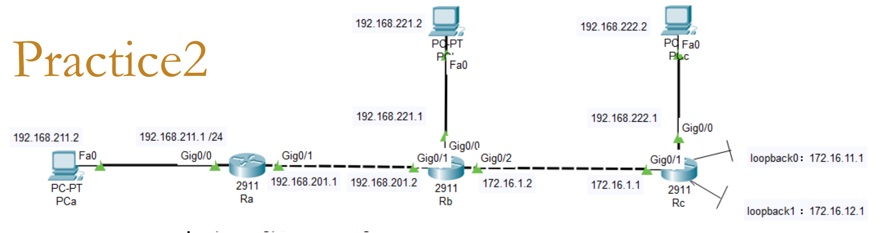 
  
1st

1. Build the network
2. Use “ no router rip ” to remove the routing items create from rip
3. Enable and Configure Single domain OSPF
4. Test to see if it works , tell the difference between rip and ospf

  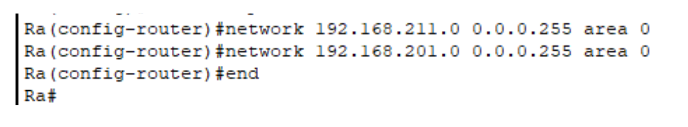 
  
2nd

  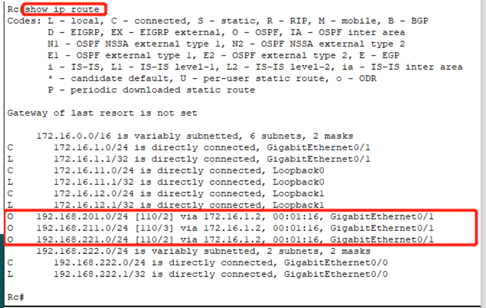 
  
3rd

