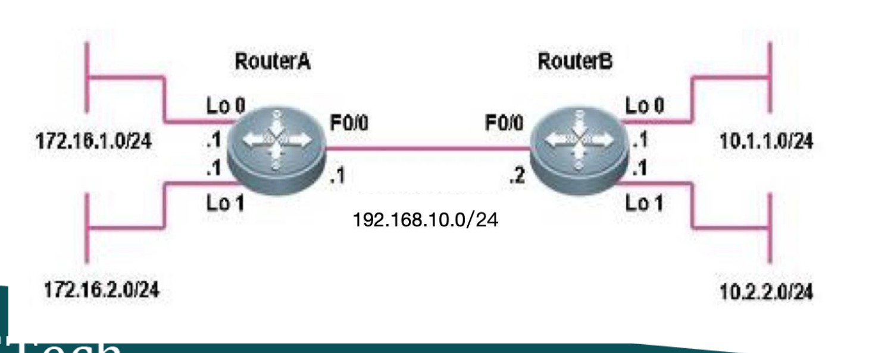
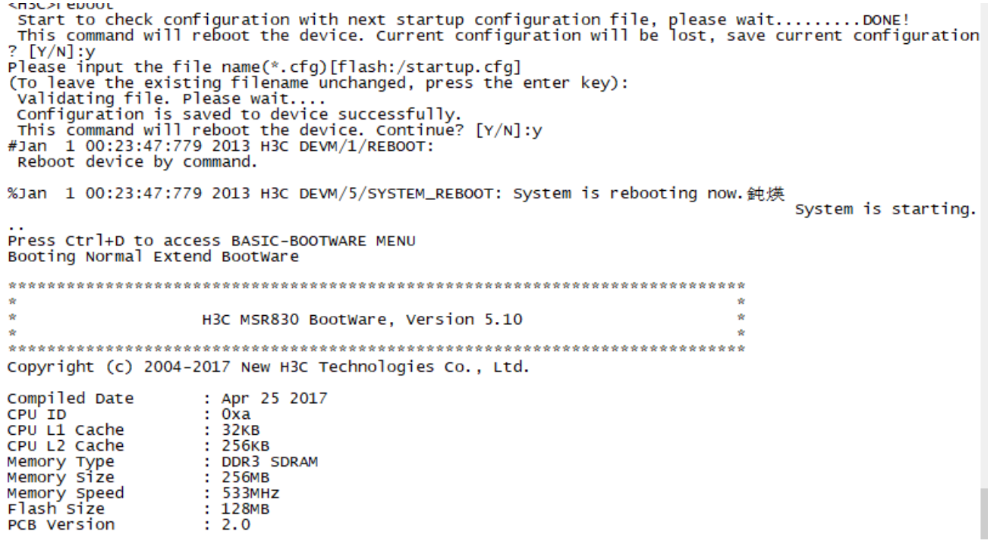
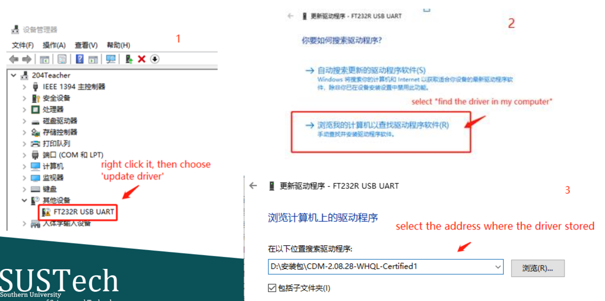
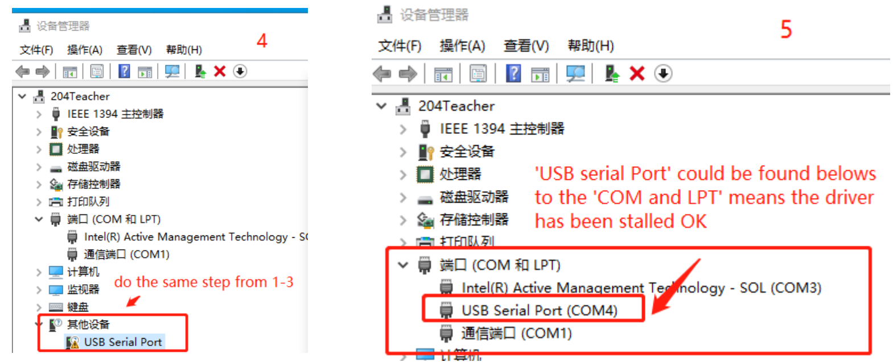

<!--
 * @Github: https://github.com/Certseeds/CS305_2019F_Remake
 * @Organization: SUSTech
 * @Author: nanoseeds
 * @Date: 2020-08-08 22:19:05
 * @LastEditors: nanoseeds
 * @LastEditTime: 2020-08-08 22:59:58
 * @License: CC-BY-NC-SA_V4_0 or any later version 
 -->
## Report 12 Details
注:下述练习需要硬件

### Practice1
Look up the info of router
  + the device and memory
  + the interface( port mode, port number, bandwidth of port, link type, ipaddress )
  + the service (default DHCP server)

Configuration
  + Rename the router with "CS305_yourID"
  + Change the port-mode of interface
  + Configure ip address on interface with different subnet
  + Create new DHCP server ip-pool, set its network, gateway-list and address-range
  + Reset the MTU of a interface

### Practice2
+ Create a internet with two PCs($PC_a$ and $PC_b$) and a Router
+ Configure the network to make:
  - $PC_a$ belongs to subnet1, $PC_b$ belongs to subnet2, Router connect subnet1 and subnet2
+ The network ID of Subnet1 and subnet2 are both B type address with 23bits network ID length
  - $PC_a$ and $PC_b$ work as DHCP client, Router work as DHCP server
  - On the Router, there are three ip-pool with different netwok and different gateway-list
+ Check
  - The ip address of $PC_a$ and $PC_b$
  - using cmd "ping” to test the connection between to PCs, are they reachable or not? Why?

### Option practice （use two routers）
1. Implement cross-router communication
2. Show the rout-table and fib info on $Router_A$ and $Router_B$
3. Save the configuration as setup configuration

   
  
1st

### Tips

+ Tips : reboot

   
  
1st

In user view "reboot” will reminds to save the current configuration as startup cfg, if you choose yes , the configuration will work on the coming reboot stage.

+ Tips(make USB Serial Port work)：
Plug the USB-to-RT45 console port in USB port on PC, if the ‘USB Serial Port' couldn't be found in the ‘COM and LPT' of Device Manager, it means stalling the driver is needed. Open the Device Manger, then following the steps:

   
  
2nd

   
  
3rd

