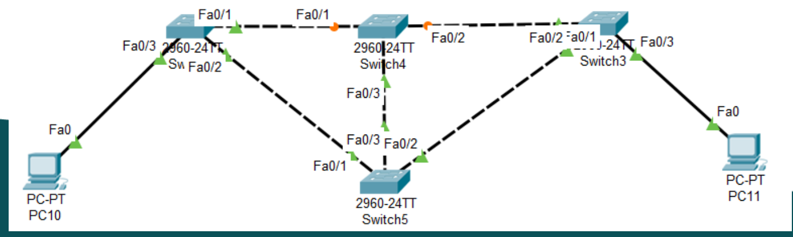
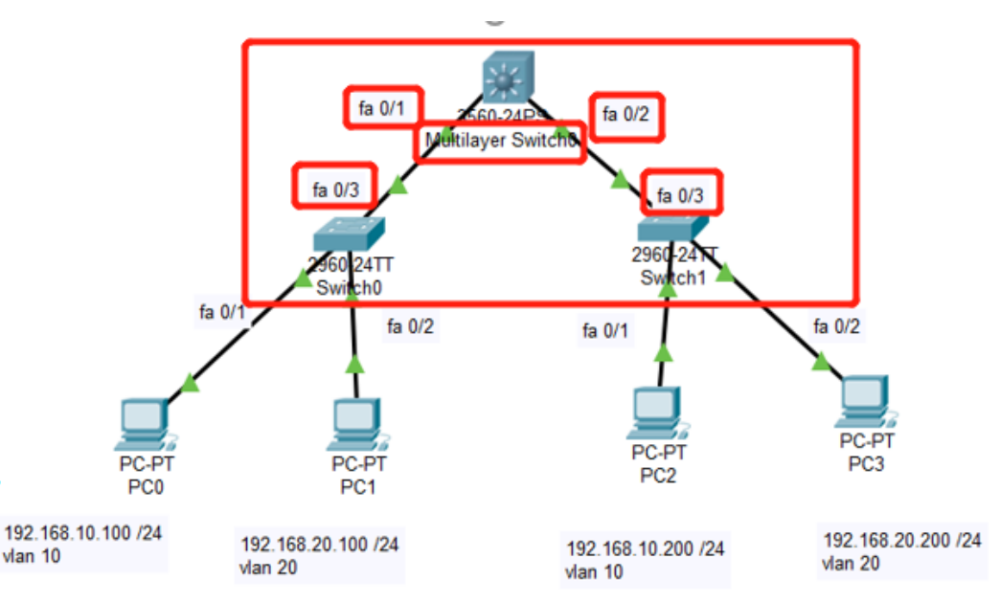
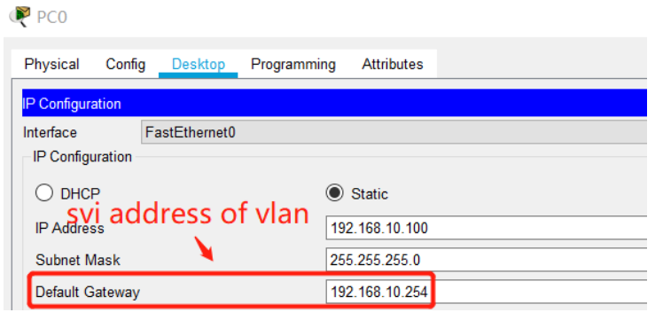
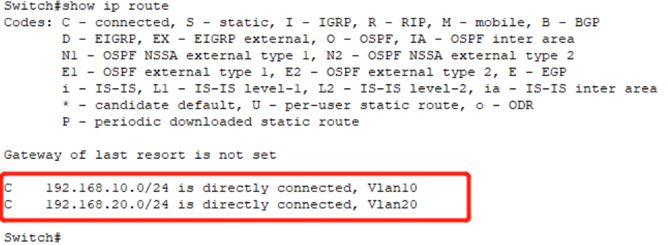

<!--
 * @Github: https://github.com/Certseeds/CS305_Remake
 * @Organization: SUSTech
 * @Author: nanoseeds
 * @Date: 2020-06-19 16:06:56
 * @LastEditors: nanoseeds
 * @LastEditTime: 2020-08-08 23:35:53
 * @License: CC-BY-NC-SA_V4_0 or any later version 
 -->
## Report 13 Details

### Practice1

Build a LAN as the topology:

- What's the state of link marked with yellow spot in the following network，will it block the communication between PC10 and PC11?
- Find the root of the spanning-tree
- Shutdown the Fa0/3 of switch5，will the root and yellow spot changes? Will the communication between PC10 and PC11 be blocked?
- Is there any way to set a new root of the spanning-tree(option)

   
  
1st

### Question 2

1. Build a LAN as the topology:

+ $PC_0$,$PC_2$ access to $vlan^{10}$
+ $PC_1$,$PC_3$ access to $vlan^{20}$

2. check Whether the PCs in the same VLAN could communicate with each other
3. make "trunk link" in the network, configure on the Multilayer Swithch to make the PC in vlan 10 could communicate with the PC in vlan 20

+ Tips: For switch0 and switch 1, make the mode of interface which connected with multilayer switch as trunk

   
  
1st

### Tips

For multilayer switch

- Make the mode of interface connect with $switch_0$ and $switch_1$ as trunk
  1. interface fa 0/1
  2. switchport trunk encapsulation dot1q
  3. Switchport mode trunk
- Make the same vlan as $switch_0$ and $switch_1$
- Make the interface of vlan ,configure its ip address and subnet mask
  1. interface vlan10
  2. ip address 192.168.10.254 255.255.255.0
- invoke the ip routing function of multilayer switch
  1. ip routing 

   
  
1st

   
  
2nd

